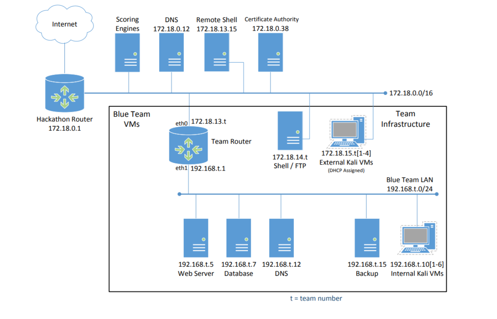
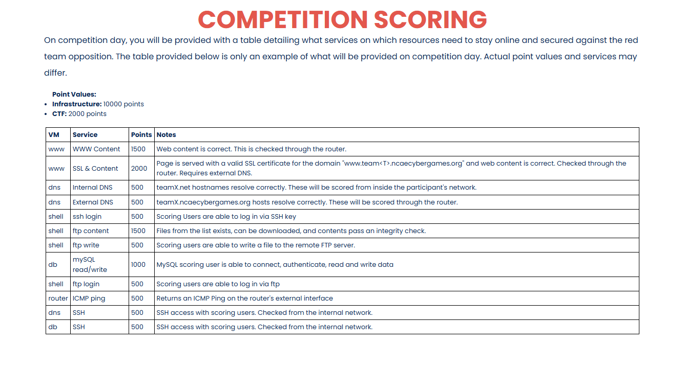

<html>

# NCAE CyberGames – Training Repository (2026)

This repository serves as the **central training, documentation, and operations hub** for the NCAE CyberGames competition. It contains all required materials for environment setup, service configuration, security hardening, recovery procedures, threat hunting, and role coordination.

---

## SECTION I: REPO NAVIGATION

This section explains the repository structure and where resources are located. A directory tree may be added later for visual reference.

### `docs/`
Contains **technical documentation and configuration references** for technologies and services used throughout training and competition.

Examples include service configuration notes, architectural explanations, and reference material.

### `issues/`
Contains **documented problems and resolutions** encountered during setup or training.

Each entry should include:
- Error messages or symptoms
- Root cause analysis
- Resolution steps

### `lessons/`
Holds **week-by-week instructional content**, including:
- Google Slides
- `weekX.md` lesson files
- Cheatsheets and reference notes

### `practiceLabs/`
Contains **supplemental labs and exercises** outside the official weekly curriculum.

These may include:
- Homework tasks
- Practice scenarios
- Skill reinforcement labs

### `scripts/`
Contains **automation scripts and workflows**, including:
- Backup scripts
- Recovery scripts
- Monitoring or detection scripts
- Helper utilities for setup and remediation

---

## SECTION II: NCAE OUTLINE

This section defines **all required knowledge domains and technical objectives** for NCAE CyberGames preparation.

---

### Base Configuration

#### A.1: Operating System Environment
- Debian vs RPM based distributions
- Operating system network configurations

#### A.2: Software Installation
- RPM-based service installation
- Debian-based service installation

#### A.3: Configuration Files & Services
- Web services with Apache / httpd
- SSH service configurations
- DNS service configurations
- PostgreSQL / MySQL configurations
- FTP service hardening and vulnerabilities

---

### System & Application Security

#### B.1: Operating System Secure Baselines
- SSH hardening configurations
- Firewall configurations (UFW / IPTables / firewall-cmd)

#### B.2: Common System Vulnerabilities

#### B.3: Application Secure Baselines
- Web service hardening
- DNS service hardening
- PostgreSQL / MySQL hardening
- FTP service hardening

#### B.4: Common Application Vulnerabilities

---

### Recovery & Backups

#### C.1: Backup Process
- `rsync` service configuration
- `cron` service scheduling and intervals

#### C.2: Recovery Process
- Backup data restoration
- Automated Bash scripts

#### C.3: Remediation
- Researching issues
- Troubleshooting methodologies

#### C.4: Fault Tolerance
- Redundancy concepts
- High availability technologies

---

### Threat Hunting

#### D.1: Detection
- Log analysis (`/var/log`)

#### D.2: Indicators of Compromise
- Unknown SSH keys
- Unknown user accounts
- Unknown login sessions
- Unknown software programs
- Modified files or system states
- Unusual or suspicious processes

---

## Weeks: Lesson Focus & Goals

| Week | Focus | Goals |
|------|------|------|
| 0 | Pre-Competition Setup | Create accounts (HackTheBox, GitHub); review NCAE rules, scoring, and structure |
| 1 | Base Configuration | Define roles; install services; complete host networking |
| 2 | Router | Understand router provisioning fundamentals |
| 3 | Hardening & Vulnerabilities (Part 1) | Apply SSH and service hardening; understand mitigated exploits; firewall configuration |
| 4 | Hardening & Vulnerabilities (Part 2) | Vulnerability identification and analysis |
| 5 | Recovery & Backups | Configure `rsync`; apply backup concepts; configure `cron`; understand recovery |
| 6 | Threat Hunting | Understand `/var/log`; identify indicators of compromise |

---

## SECTION III: ROLES

This section outlines the **core operational roles** required for success during NCAE CyberGames.

---

### Web Administrator
Responsible for all scored web services.

Mapped Scoring Areas:
- WWW content availability
- SSL & web content validation
- Apache/httpd uptime
- TLS certificate validity

---

### DNS Administrator
Maintains internal and external DNS services.

Mapped Scoring Areas:
- Internal DNS resolution
- External DNS resolution
- Hostname validation for SSL and web services

---

### FTP Administrator
Manages file transfer services.

Mapped Scoring Areas:
- FTP login
- FTP content download
- File integrity validation
- FTP write access

---

### Database Administrator
Maintains database reliability and integrity.

Mapped Scoring Areas:
- MySQL/PostgreSQL authentication
- Read/write access
- Application database dependencies

---

### SSH Administrator
Ensures secure remote access.

Mapped Scoring Areas:
- SSH access for scoring users
- Key-based authentication
- Internal network access validation

---

### CTF Master | Network Administrator
Controls network-level access and routing.

Mapped Scoring Areas:
- Router ICMP reachability
- External access paths
- Firewall and port forwarding rules

---

### Incident Responder
Restores services during compromise.

Mapped Scoring Areas:
- Indirect impact on all infrastructure scoring
- Service restoration and stabilization

---

### Roles Without Direct Point Attribution

Some roles are **not tied to a specific scoring line item**, but are essential for competition success.

These include:
- SOC Analyst
- Backup Manager
- CTF Master (non-network responsibilities)

While these roles may not generate points directly, they enable faster detection, recovery, coordination, and strategic decision-making.

---

## SECTION IV: PHASES

### Phase A: Environment & Access Preparation  
**Estimated Time Range:** Weeks 0–1

Success Criteria:
- All accounts created and accessible
- Hosts are reachable on the network
- Roles assigned and understood
- Base services install successfully

---

### Phase B: Core Services & Network Control  
**Estimated Time Range:** Weeks 2–3

Success Criteria:
- Router responds to ICMP
- DNS resolves internally and externally
- SSH access works with keys
- Web, FTP, and database services are reachable
- Firewall rules enforce intended access

---

### Phase C: Hardening, Vulnerabilities & Recovery  
**Estimated Time Range:** Weeks 4–5

Success Criteria:
- Hardening does not break scoring
- Backups run on schedule
- Restoration procedures tested
- Common vulnerabilities mitigated

---

### Phase D: Threat Hunting & Competition Readiness  
**Estimated Time Range:** Week 6 and Ongoing

Success Criteria:
- Logs actively monitored
- Indicators of compromise identified quickly
- Services restored rapidly after incidents
- Environment remains stable under attack

</html>
