# Week 2 Summary

---

## Prerequisites

- Mikrotik Router ISO Installed in a VM
- Rocky or Ubuntu ISO Installed in a VM
- Three Virtual Network Adapters (3 virtual networks total)
  - LAN 1
  - LAN 2
  - WAN

---

## Install Mikrotik Router

### 1. Boot into the Router

Boot into the Microtik Router, you will see a boot screen like this:

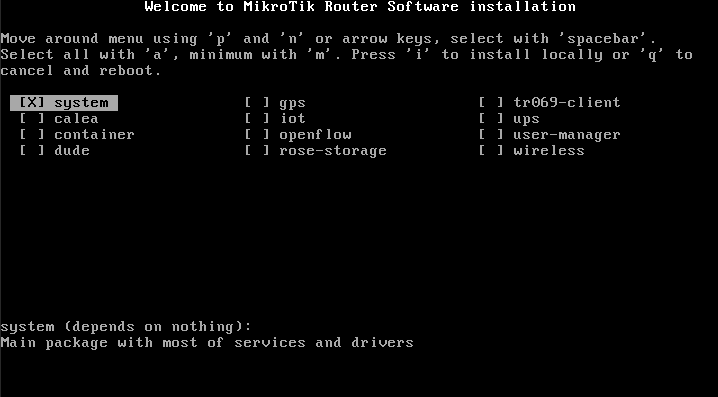

To install the MikroTik Router Software:

```text
- A. Press *i*, it will ask you to confirm  
- B. Press *y*, it will take a few seconds to install  
- C. Press *ENTER* to reboot  
```
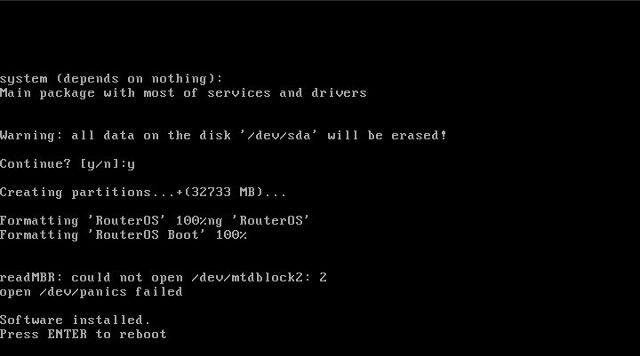

---

### 2. Login into the Router

Login into the router using the following credentials:

- **Username:** admin  
- **Password:** **NCAE**

**IMPORTANT:**  
The password must be entered in **ALL CAPS**. Passwords on MikroTik are case-sensitive.

If login fails:
- Check Caps Lock
- Verify you typed `NCAE` exactly
- Ensure you are logging in as `admin`

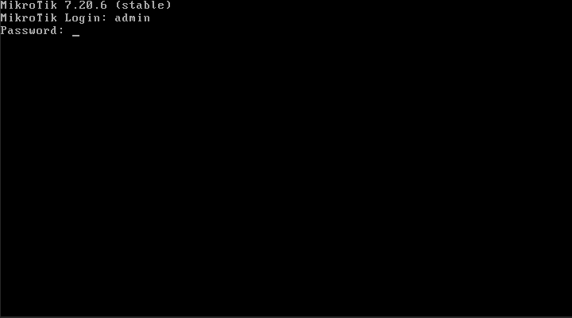

---

### 3. Software License Prompt

After you login you will be presented with the software license prompt, press *n*

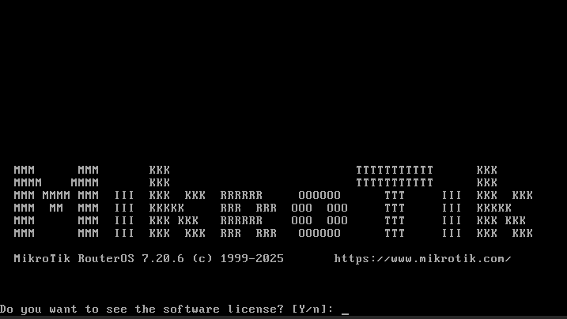

Then you will be presented to continue with the current installation, press *ENTER*

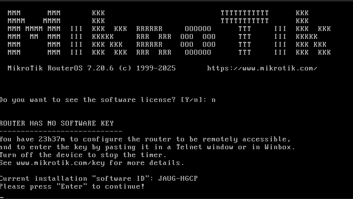

---

### 4. Change Password

If prompted to change the password again, enter **NCAE** (ALL CAPS).

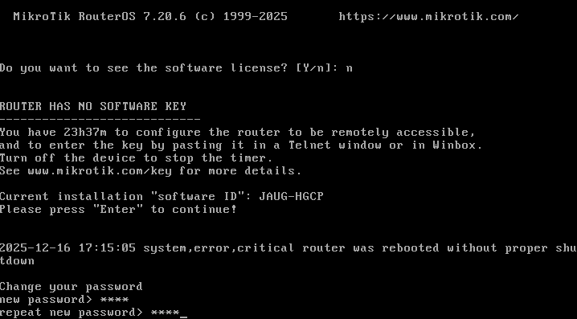

You should see a terminal prompt when you successfully change the password.

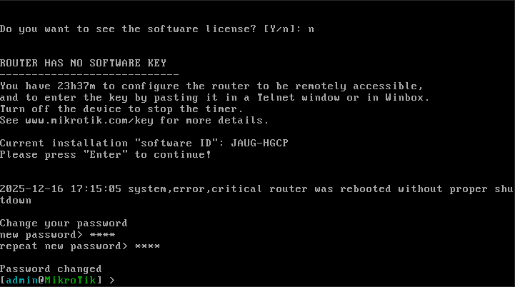

---

## Configure the Internal (LAN) and External (WAN) Network Mikrotik Router

This section will go over configuring the Mikrotik Router.

**IMPORTANT:**  
The IP address values in the picture and commands can change depending on the environment.

`t = team number`

---

## Configure WAN Interface (External Network)

### 1. Define WAN Interface

We need to define our WAN interface. This will be important when we are trying to forward traffic to different networks.
```bash
interface/bridge/add name=WAN
```
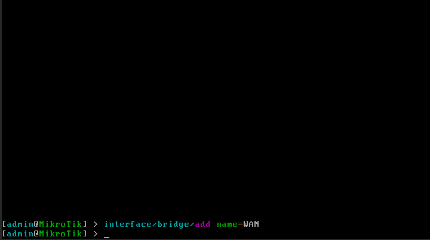

---

### 2. Map WAN to Virtual Network Interface

We need to define the virtual network interface (think of it as a virtual implementation of a physical Network Interface Card / Ethernet Port) that maps to our initial *WAN* bridge identifier.
```bash
interface/bridge/port add interface=ether1 bridge=WAN
```
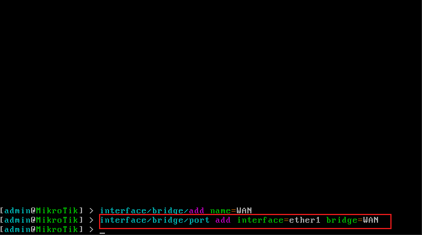

### Informational (NOT NEEDED FOR THE LAB):  
Usually the WAN interface is configured on the first ethernet port (ether1). This may change depending on how the virtual adapters are added.

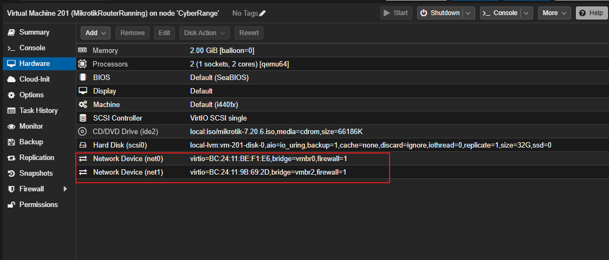

If you want to see adapter order in VirtualBox:
Settings → Network

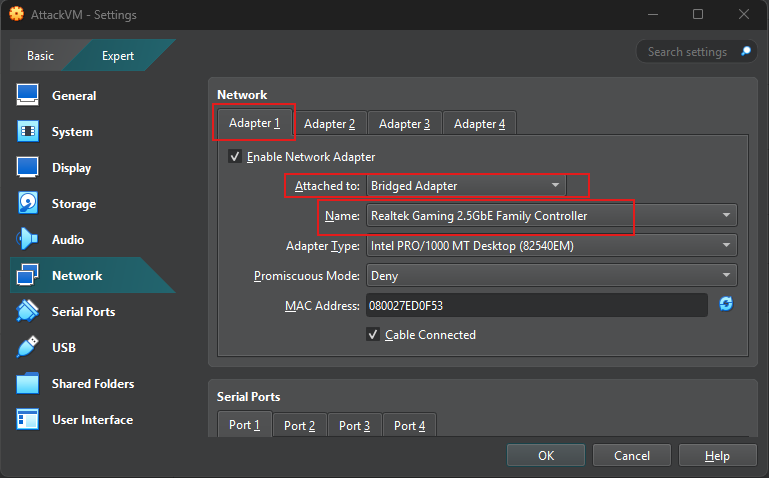
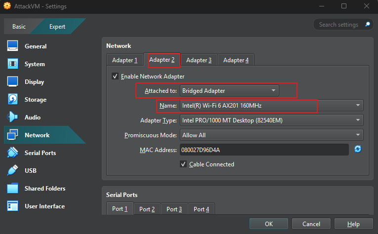

---

### 3. Assign WAN IP Address

The WAN network for the competition is:

`172.18.0.0/16`

Assign the team router WAN IP:
```BASH
/ip address add address=172.18.13.t/16 interface=WAN
```
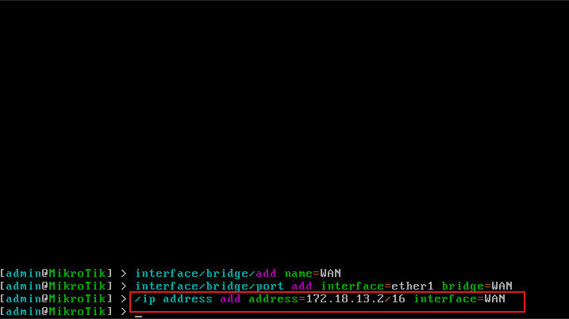

---

### 4. Add Default Route

A default route tells the router where to send traffic when no specific route exists.

Think of it as:  
“If I do not know where this packet belongs, forward it here.”
```BASH
/ip route add dst-address=0.0.0.0/0 gateway=172.18.0.1
```
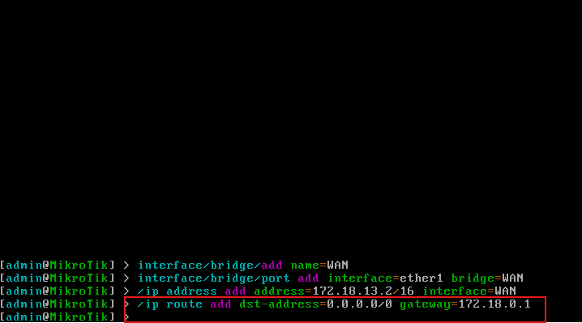

---

### 5. Add NAT Masquerade Rule

We need to allow internal Blue Team machines to access external networks.
```bash
/ip firewall nat add chain=srcnat src-address=192.168.t.0/24 action=masquerade
```
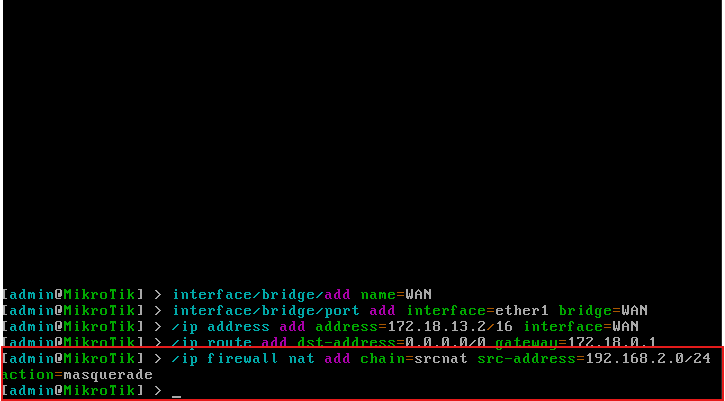

**What This NAT Rule Does**

This rule enables **Network Address Translation (NAT)** using **masquerading**.

Masquerading allows internal machines on the Blue Team LAN  
(`192.168.t.0/24`) to communicate with external networks by:

- Rewriting the **source IP address** of outbound packets
- Replacing the private LAN IP with the router’s WAN IP
- Tracking connections so return traffic is sent back to the correct internal host

Think of masquerading like this:

> “When an internal machine sends traffic out, the router speaks on its behalf.”

Without this rule:
- Internal machines can send traffic out
- Return traffic never comes back
- Internet access appears broken even though routing exists

**NOTE:**  
NAT handles **address translation**, not **traffic permission**.  
Firewall rules are still required to allow or block traffic.

---

### 6. Test WAN Connectivity
```bash
ping 172.18.0.1
```
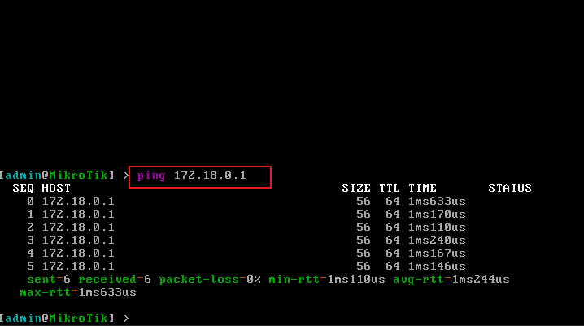

---

## Configure LAN Interface (Blue Team LAN)

The internal Blue Team network is:

`192.168.t.0/24`

---

### 1. Define LAN Interface

The LAN is the network your internal hosts will join.  
Without a LAN, hosts cannot reach the WAN.
```bash
interface/bridge/add name=LAN
```


---

### 2. Map LAN to Virtual Network Interface
```bash
interface/bridge/port add interface=ether2 bridge=LAN
```
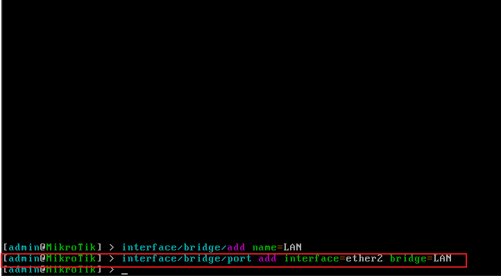

---

### 3. Assign LAN IP Address
```bash
/ip address add address=192.168.t.1/24 interface=LAN
```
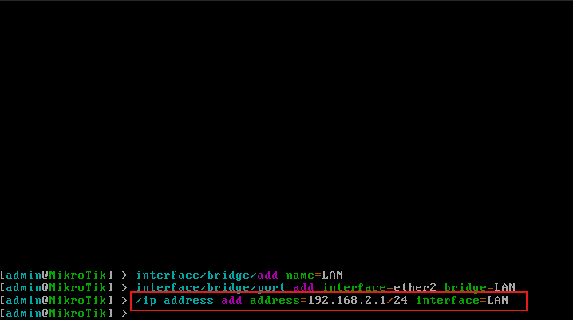

---

### 4. Test LAN Connectivity
```bash
ping 192.168.t.1
```
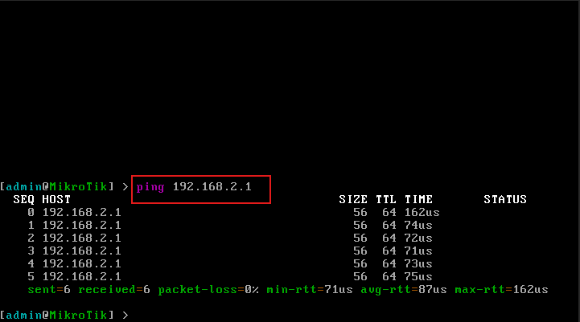

---

## Configure Host Networking on Host Machine

This was covered in Week 1. Below is a brief reference using the updated topology.

Assign IP address:
```bash
nmcli connection modify "Wired connection 1" ipv4.address "192.168.t.2/24"
```
Assign default gateway:
```bash
nmcli connection modify "Wired connection 1" ipv4.gateway "192.168.t.1"
```
Set method:
```bash
nmcli connection modify "Wired connection 1" ipv4.method manual
```
Restart connection:
```bash
nmcli connection down "Wired connection 1"  
nmcli connection up "Wired connection 1"
```
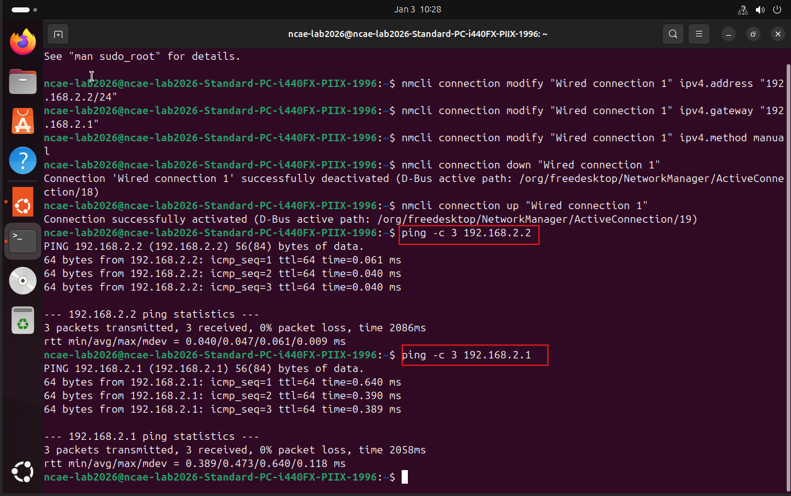

---

## Install and Configure Host Web Service on Host Machine

Install Apache:
```bash
sudo apt update && sudo apt install apache2 -y
```
Browse to:
```text
http://localhost
```
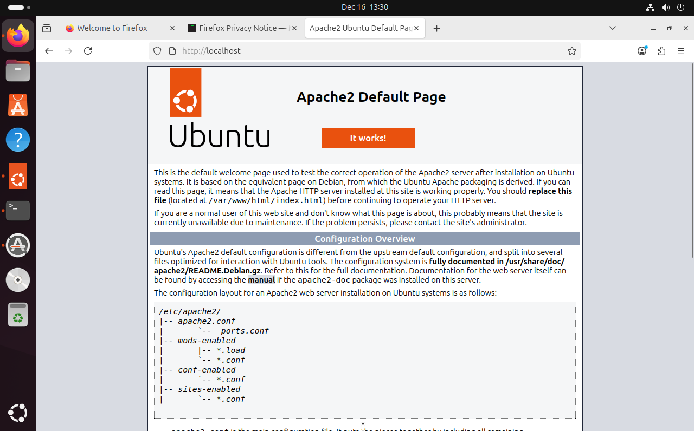

---

## Allow Port Forwarding for Web Machine

This section introduces **port forwarding**, which allows external users to access internal services.

---

### 1. Access Router GUI

Navigate to:
```text
http://172.18.13.t
```
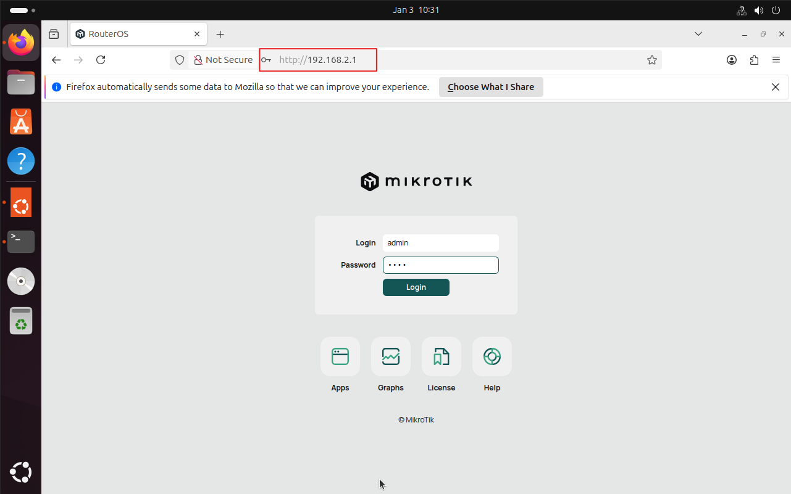


---

### 2. Navigate to NAT Settings

Advanced → IP → Firewall → NAT → New

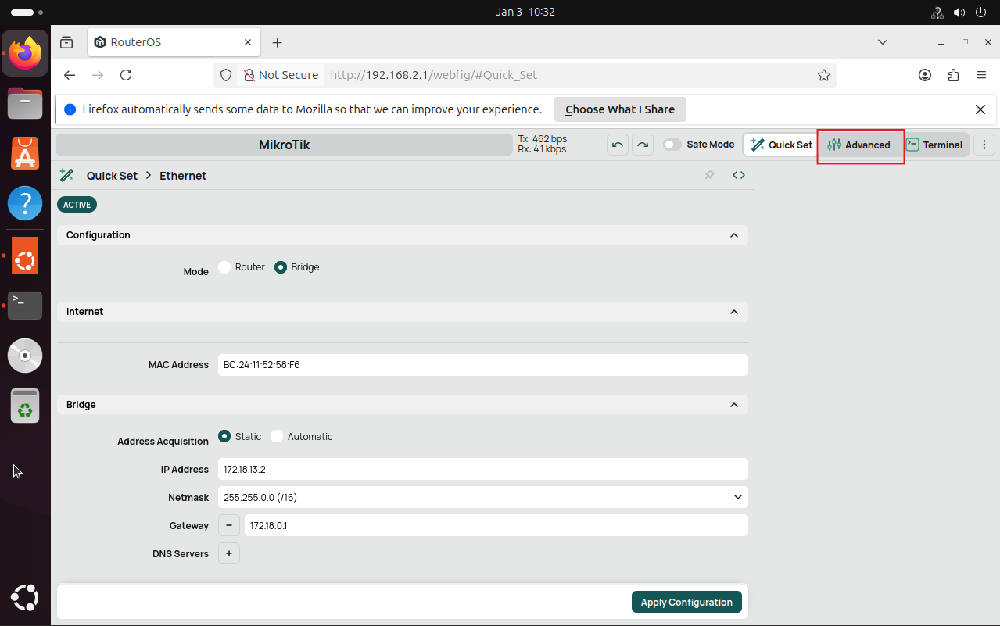
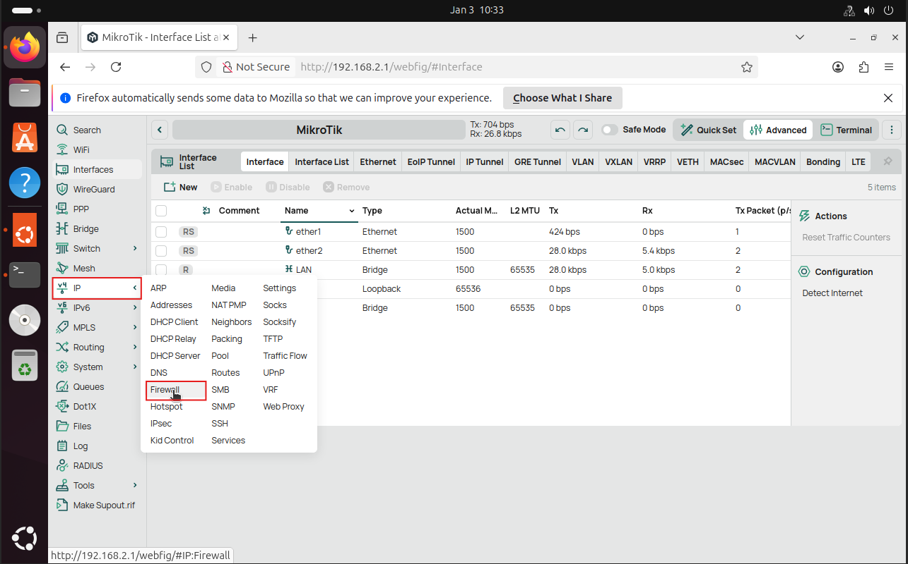
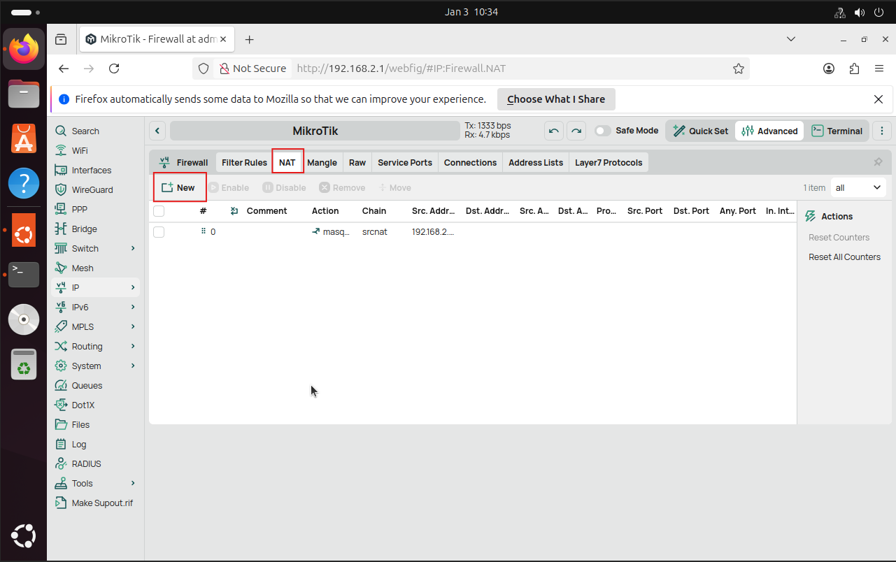

---

### 3. Configure DST-NAT Rule

General Tab:
```text
- Chain: dstnat
- Protocol: tcp
- Dst. Port: 80
- In. Interface: WAN
```
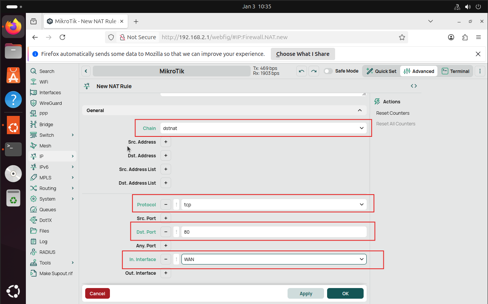

Action Tab:
```text
- Action: dst-nat
- To Addresses: 192.168.t.5
- To Ports: 80
```
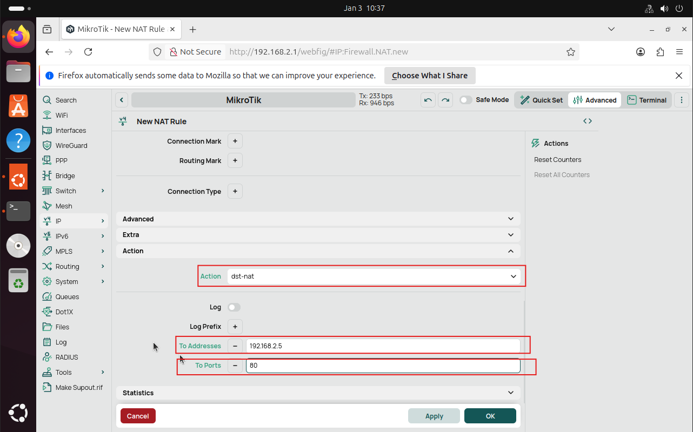

---

### 4. Reorder NAT Rules

Move the DST-NAT rule above the masquerade rule.

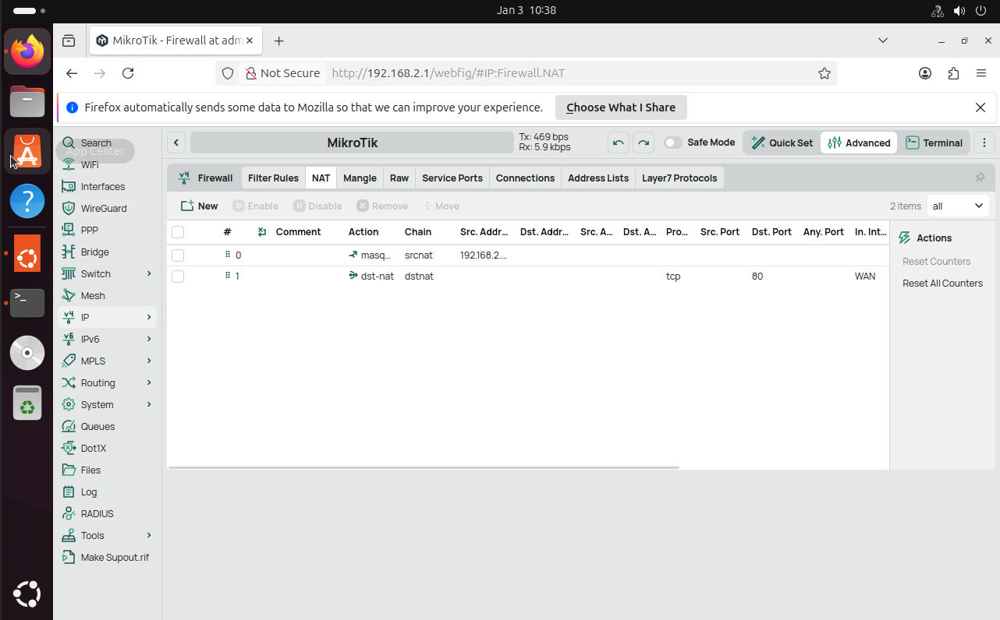
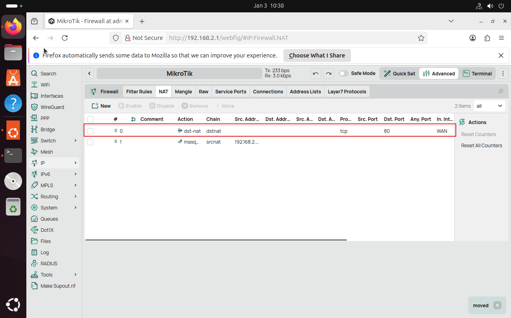

---

### 5. Add Firewall Filter Rule

Filter Rules → New

General Tab:
```text
- Chain: forward
- Protocol: tcp
- Dst. Port: 80
- Out. Interface: LAN
```
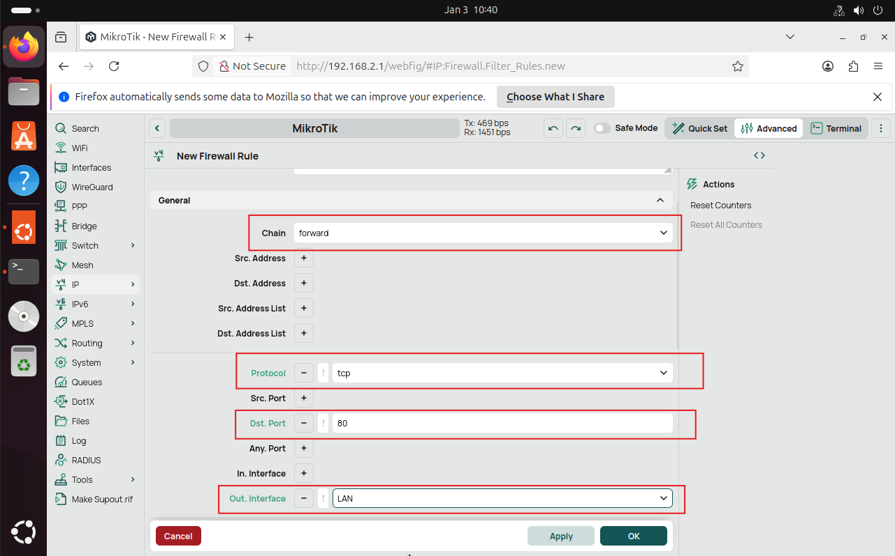

Action Tab:
```text
- Action: accept
```
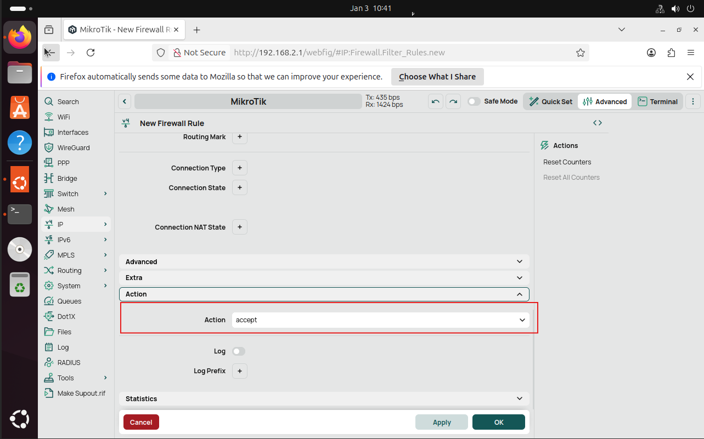

---

### 6. Test Port Forwarding

From an external machine, browse to:
http://172.18.13.t

You should see the Apache default page.

**NOTE:** Testing from the same LAN will not work.

