# Week 4 Summary – SSH / Remote Shell Server

---

## Prerequisites

- Mikrotik Router ISO Installed in a VM  
- Rocky or Ubuntu ISO Installed in a VM (**Database Server**)  
- Rocky or Ubuntu ISO Installed in a VM (**DNS Server**)  

- Two Virtual Network Adapters (2 virtual networks total)
  - LAN
  - WAN

**Note:** Please review `Week2.md` if you are unsure how to configure the router or host networking.


`t = team number`

---

## SSH Install

### 1. Install OpenSSH Server

If not installed already, install the OpenSSH Server package:

```bash
sudo apt update && sudo apt install ssh -y
```
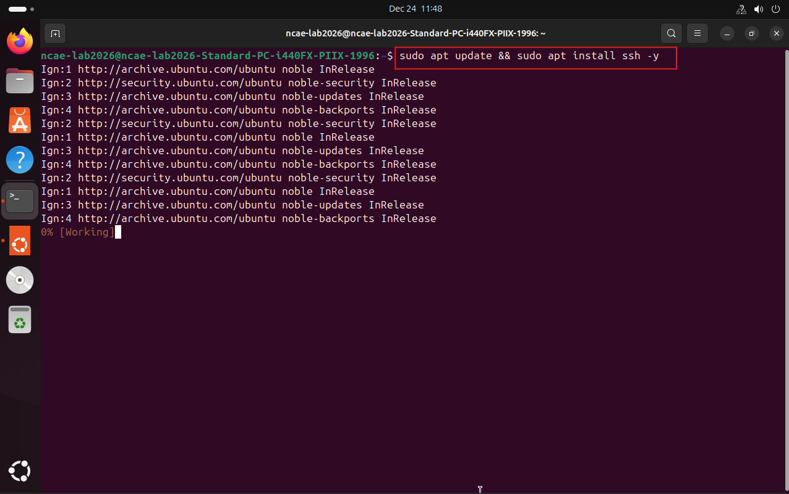

**Note:**  
SSH follows a **client–server architecture**.

- The machine you log *into* must be running an **SSH server**
- The machine initiating the connection is the **client**
- A machine can act as both a client and a server depending on context

---

## Ensure SSH Is Installed & Running (ALL MACHINES)

### 2. Start and Verify SSH Service

For **any machine you want to SSH into**, OpenSSH Server must be installed and running.  
This applies to the **SSH**, **DNS**, and **WEB** machines.

Start the SSH service:
```bash
sudo systemctl start ssh
```
Check the SSH service status:
```bash
sudo systemctl status ssh
```
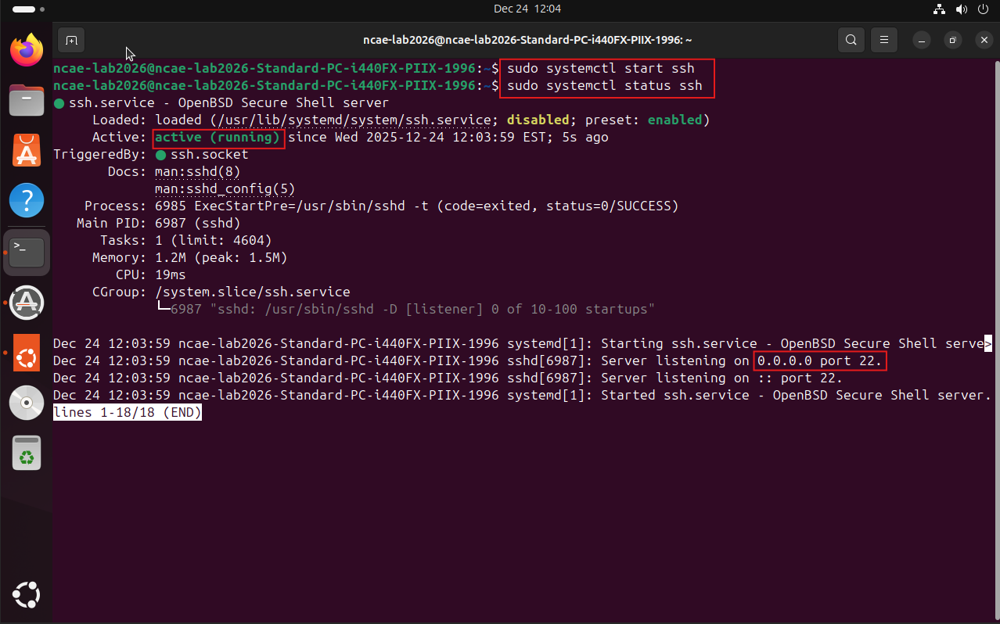

**Note:**  
Repeat SSH installation and service checks on all applicable machines.

---

## Connect to Other Internal Machines

### 3. Remote Login Using SSH

From the **SSH machine**, open a terminal and connect to the following systems.

---

#### Remote Login to MikroTik Router (EXAMPLE)

```bash
ssh admin@172.18.13.t
```

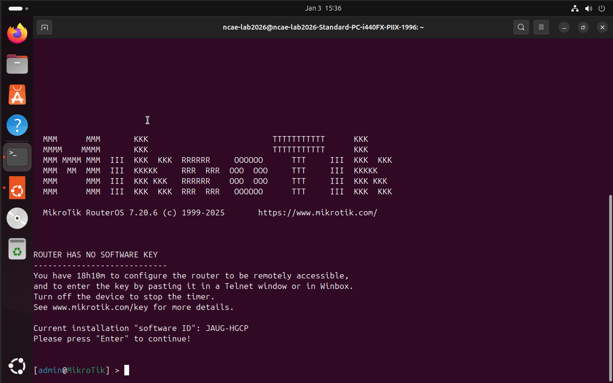

**Credentials Reminder**
- Username: `admin`
- Password: **NCAE** (ALL CAPS)

Open a new terminal/tab on the SSH machine before continuing.

---

#### Remote Login to DNS Server

```bash
ssh ncae-lab2026@192.168.t.12
```
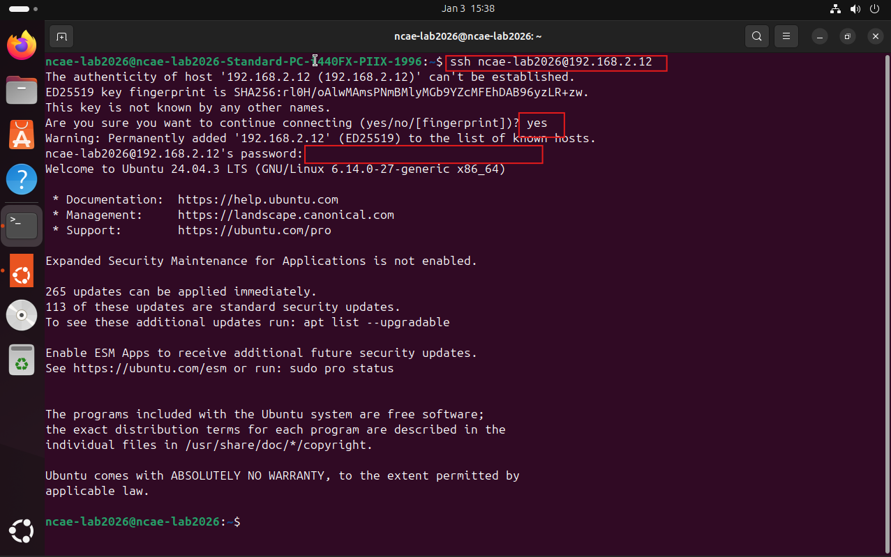

Open a new terminal/tab on the SSH machine.

---

## Connecting Using SSH Keys

### 4. Generate SSH Keypair

Instead of using a password, SSH supports **public key authentication**.

**Note:**  
Public key cryptography has significant depth. For competition purposes, understanding usage is sufficient.

Generate an SSH keypair on the SSH machine:

```bash
ssh-keygen -t ed25519 -a 100 -f ~/.ssh/SSHSERVER -C "ncae-lab2026@SSHServer"
```
Explanation of options:
- `ssh-keygen` – Generates SSH keys  
- `-t` – Algorithm type  
- `-a` – Key derivation rounds  
- `-f` – Output file location  
- `-C` – Comment/label for identification  

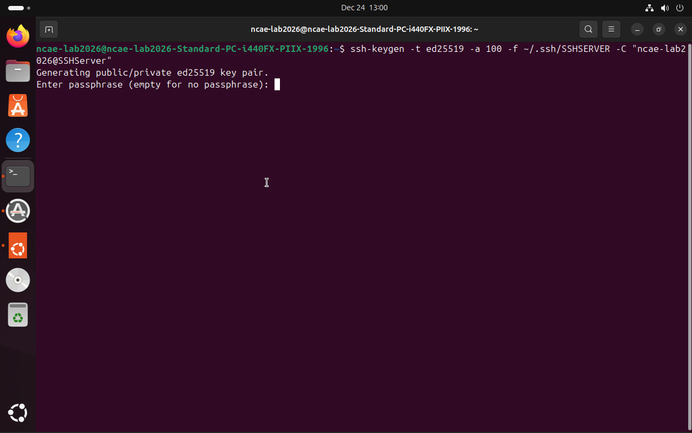

---

### 5. Set SSH Key Password

When prompted, enter the password **NCAE**.

This ensures that even if the key is stolen, it cannot be used without the passphrase.

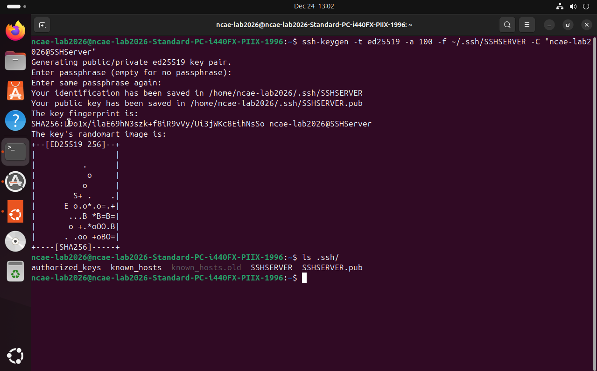

---

### 6. Identify the Public Key

To use key-based login, you need the **public key** file.

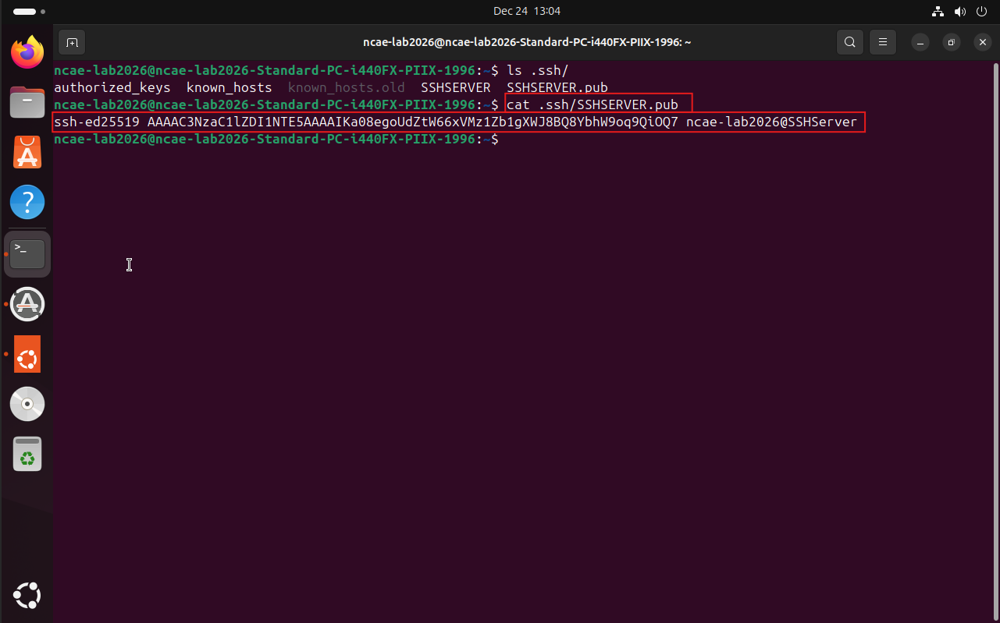

**IMPORTANT:**  
Never share the private key (`SSHSERVER`). The private key must remain secret.

---

### 7. Add Public Key to Remote Server

Log into the remote server and add the public key to:

```text
~/.ssh/authorized_keys
```
You can use `echo` to append the key without opening the file:

```bash
echo "(THE ENTIRE LINE OF THE SSH PUBLIC KEY GOES HERE)" >> ~/.ssh/authorized_keys
```
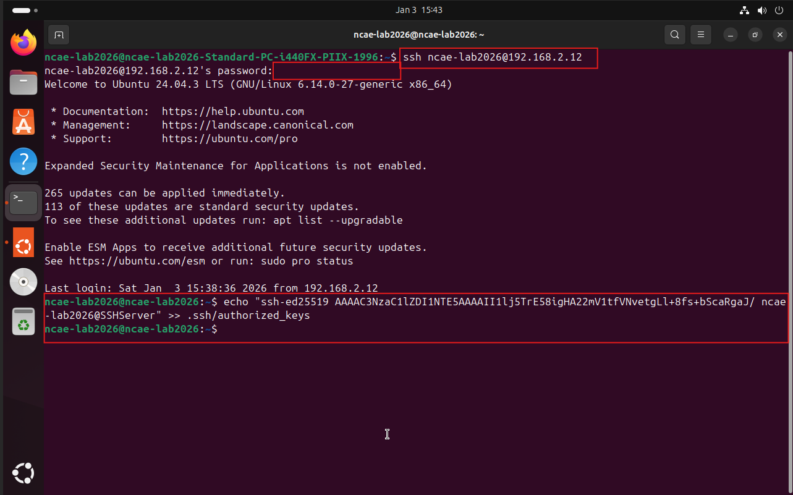

---

### 8. Login Using SSH Key

Exit the session and reconnect to the server:

```bash
ssh 192.168.t.12
```
You will be prompted for the SSH key passphrase.

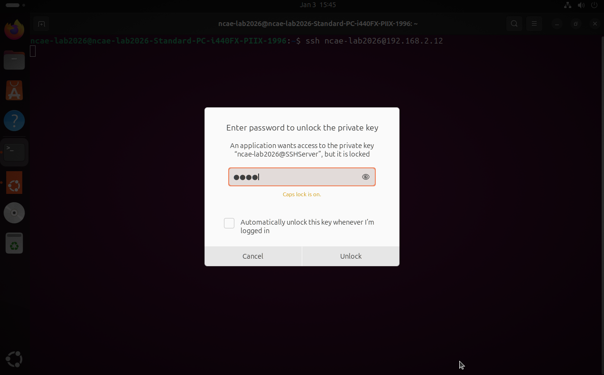
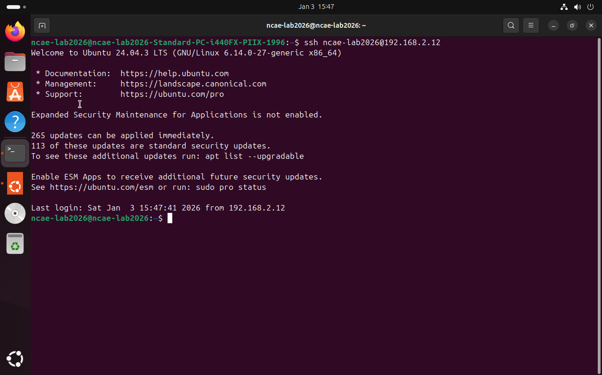

---

### 9. Repeat for All Machines

Repeat the SSH key setup process for:
- DNS Server
- WEB Server
- Any additional internal services

---

## SSL & Content

---

### 10. Open HTTPS Port (443)

In order for **Certbot** to communicate with the NCAE Certificate Authority  
(`ca.ncaecybergames.org`) and establish secure HTTPS communication, **port 443**
must be forwarded on the MikroTik router.

This allows inbound TLS traffic from the WAN to reach the internal web server.


**General Tab**
```text
- Chain: dstnat
- Protocol: tcp
- Dst. Port: 443
- In. Interface: WAN
```
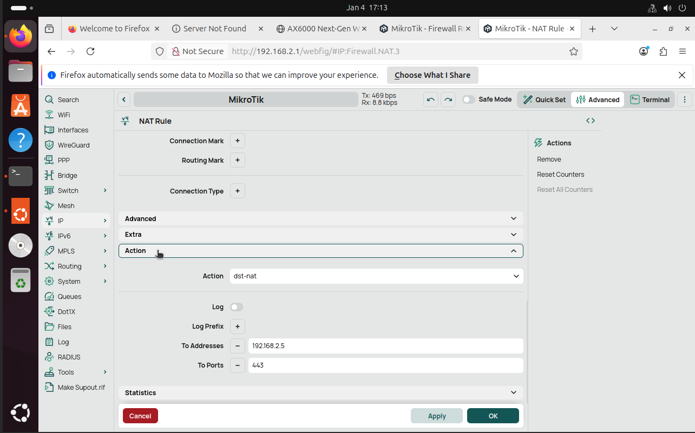

**Action Tab**
```text
- Action: dst-nat
- To Addresses: 192.168.t.5
- To Ports: 443
```
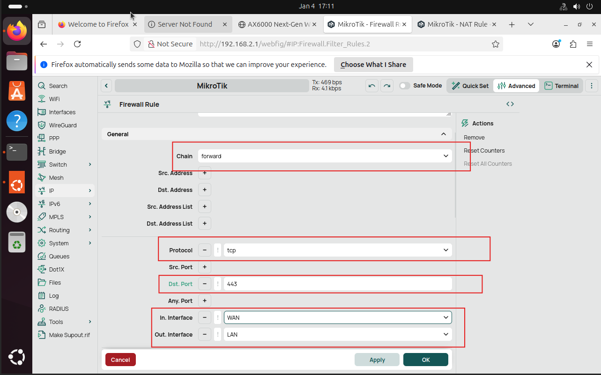

To allow forwarded HTTPS traffic to pass through the router, add a firewall
filter rule.

```text
- Chain: forward
- Protocol: tcp
- Dst. Port: 443
- In. Interface: WAN
- Out. Interface: LAN
```
---

### 11. Configure Port Forwarding for DNS (WAN → LAN)

To allow **external devices** to resolve domain names using the **internal DNS
server**, configure a DNS port forward using **UDP port 53**.

Navigation path:

Go to **Advanced** → **IP** → **Firewall** → **NAT** → **New**


**General Tab**
```text
- Chain: dstnat
- Protocol: udp
- In. Interface: WAN
```


**Action Tab**
```text
- Action: dst-nat
- To Addresses: 192.168.t.12
- To Ports: 53
```
---

To allow DNS responses to exit the LAN, add a firewall filter rule.

Navigation path:

Go to **Advanced** → **IP** → **Firewall** → **Filter Rules** → **New**


**General Tab**
```text
- Protocol: udp
- Dst. Port: 53
- Out. Interface: LAN
```
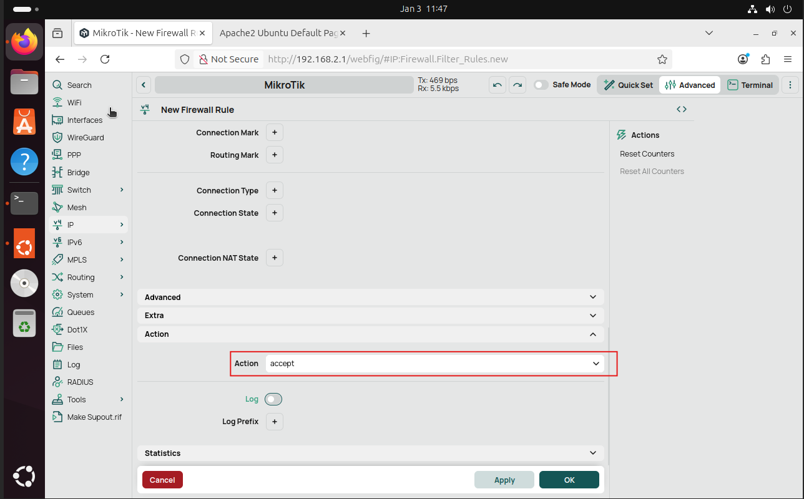

**Action Tab**
```text
- Action: accept
```
---

### 12. Installing the Certificate (NCAE CA)

Install the **NCAE Root Certificate Authority certificate** on the web server.
On competition day, the certificate may already be present or provided through
another secure channel.

Download the root CA certificate:

```bash
wget https://ca.ncaecybergames.org/roots.pem --no-check-certificate
```
Copy the certificate into the system trust store:

```bash
sudo cp roots.pem /usr/local/share/ca-certificates/ncae-root-ca.crt
```
Update trusted certificates:

```bash
sudo update-ca-certificates
```
---

### 13. Request & Install HTTPS Certificate (Certbot)

Use **Certbot** to request and install a TLS certificate from the NCAE CA for
the web server.

```bash
sudo certbot --apache --server https://ca.ncaecybergames.org/acme/acme/directory -d www.teamt.ncaecybergames.org
```
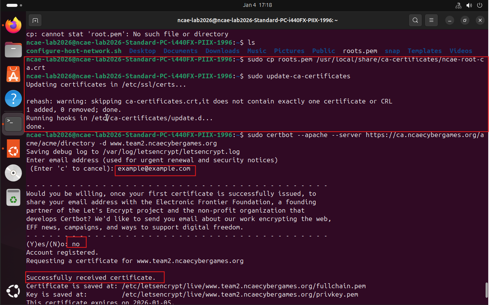

Once complete, HTTPS should be fully functional.

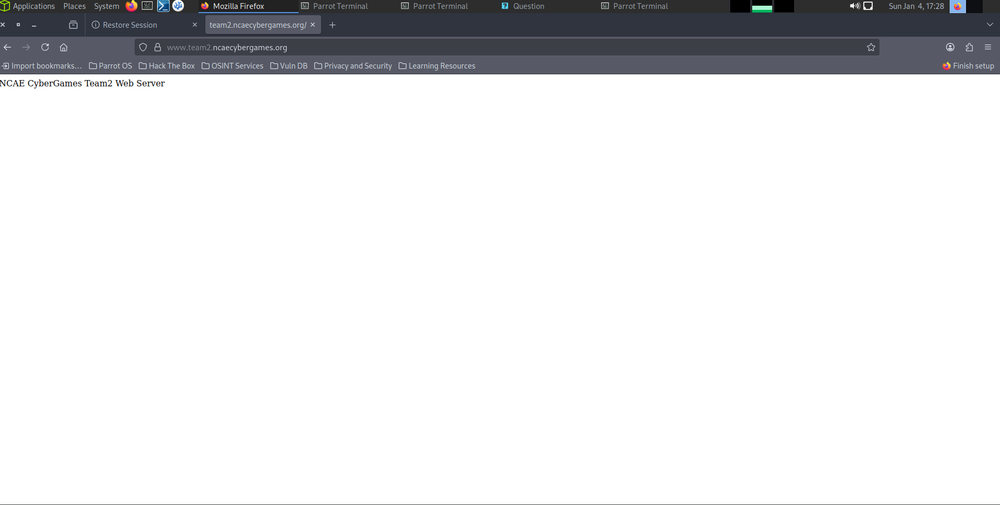

---

