# Week 5 Summary – Database & File Services (PostgreSQL / SMB)

---

## Prerequisites

- Mikrotik Router ISO Installed in a VM  
- Ubuntu 24.04 Installed in a VM (**Database Server**)  
- Ubuntu 24.04 Installed in a VM (**Shell / File Server**)  

- Two Virtual Network Adapters (2 virtual networks total)
  - LAN
  - WAN

**Note:** Please review `Week2.md` if you are unsure how to configure the router or host networking.

`t = team number`

---

## PostgreSQL (Database Server)

This section focuses on configuring **PostgreSQL** to meet the **NCAE scoring requirements** for the database service.

The database server is used to:
- Store data for the web application
- Allow automated QA processes to read from the database
- Allow occasional write operations back into the database

PostgreSQL is **scored only from the internal team network** using the database server’s internal IP address.

---

## PostgreSQL Concepts (High Level)

You do **not** need deep database administration knowledge for the competition.  
The objective is to ensure PostgreSQL behaves exactly how scoring expects.

### What is SQL?

SQL (Structured Query Language) is used to:
- Create databases and tables
- Insert, read, update, and delete data
- Control access to stored data

### What Is a Database?

A database is a structured way to store information.

Think of it like:
- Excel = single spreadsheet
- PostgreSQL = multiple spreadsheets, users, permissions, and network access

---

### PostgreSQL Architecture (Simplified)

PostgreSQL is organized into the following components:

- **Database Cluster**  
  The PostgreSQL service running on the system

- **Databases**  
  Logical containers that store tables

- **Tables**  
  Structures that hold data

- **Rows (Records)**  
  Individual entries in a table

- **Roles**  
  PostgreSQL users that authenticate and access data

---

## PostgreSQL Scoring Requirements (IMPORTANT)

The scoring engine expects **specific values**.

**Scoring User**
- Username: `bill_kaplan`
- Password: `b1ackjack!`

**Database**
- Name: `db`

**Table**
- Name: `users`

**Permissions**
- Ability to log into PostgreSQL
- Ability to read data from the `users` table
- Ability to write data to the `users` table

**Scoring Source**
- Internal network
- Database IP: `192.168.t.7`

If any of these are missing or misconfigured, scoring will fail.

---

## PostgreSQL Install & Configuration (Ubuntu)

### 1. Install PostgreSQL

Update packages and install PostgreSQL:

```bash
sudo apt update && sudo apt install postgresql postgresql-contrib -y
```
---

### 2. Verify PostgreSQL Is Running

Start and verify the PostgreSQL service:
```bash
sudo systemctl start postgresql  
sudo systemctl status postgresql
```
PostgreSQL should be in an **active (running)** state.

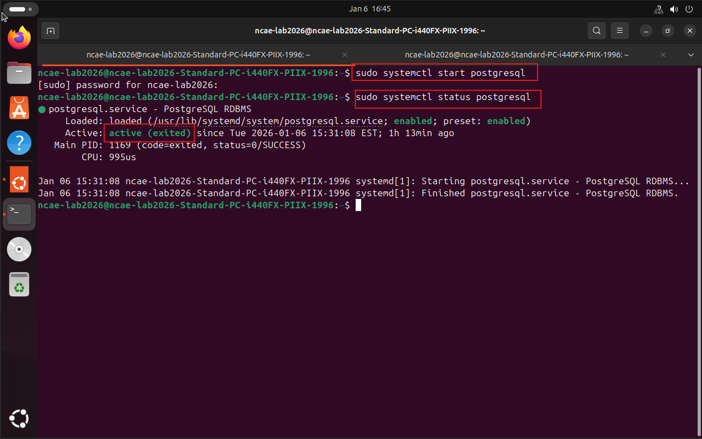
---

### 3. Login and creating the Scoring Role

Switch to the PostgreSQL administrative account:
```bash
sudo -i -u postgres
```
Login to PostgresSQL server:
```bash
psql
```
Create the scoring user:
```bash
CREATE ROLE bill_kaplan WITH LOGIN PASSWORD 'b1ackjack!';
```
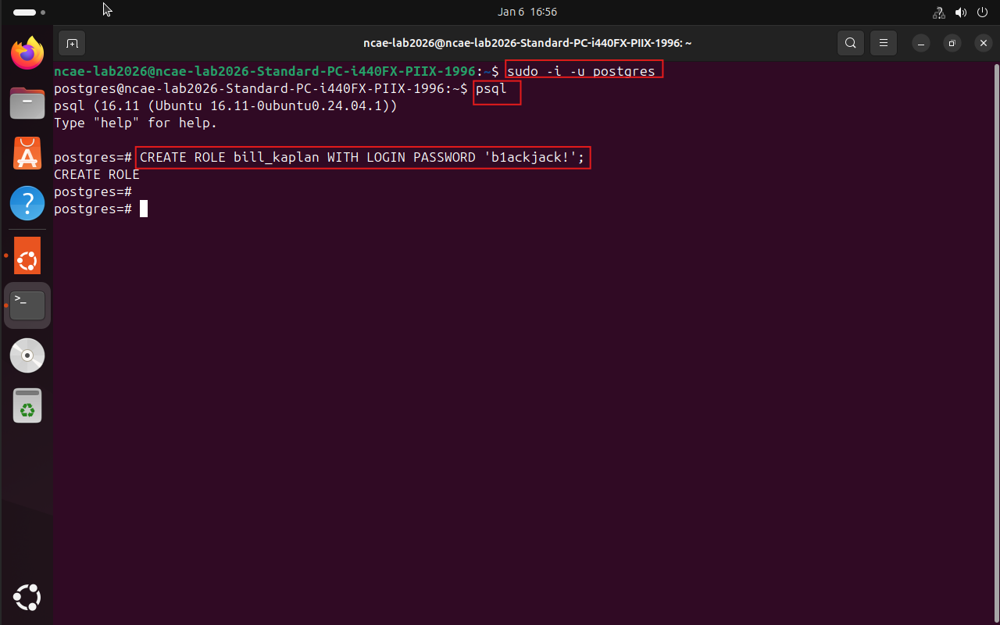
---

### 4. Create the Database

Create the required database:
```bash
CREATE DATABASE db;
```
Grant access to the scoring user:
```bash
GRANT ALL PRIVILEGES ON DATABASE db TO bill_kaplan;
```
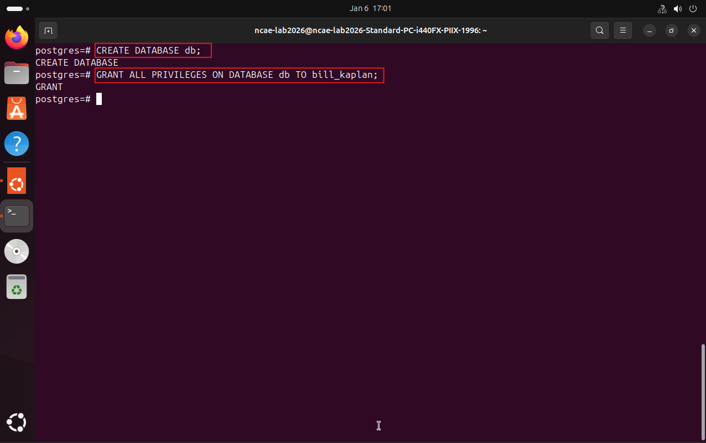
---

### 5. Create Required Table

Connect to the database:
```bash
\c db
```
Create the `users` table:
```bash
CREATE TABLE users (
    id SERIAL PRIMARY KEY,
    username TEXT,
    email TEXT
);
```
Grant permissions to the scoring user:
```bash
GRANT USAGE, SELECT ON SEQUENCE users_id_seq TO bill_kaplan;

GRANT USAGE ON SCHEMA public TO bill_kaplan;

GRANT SELECT, INSERT, UPDATE, DELETE ON TABLE users TO bill_kaplan;
```
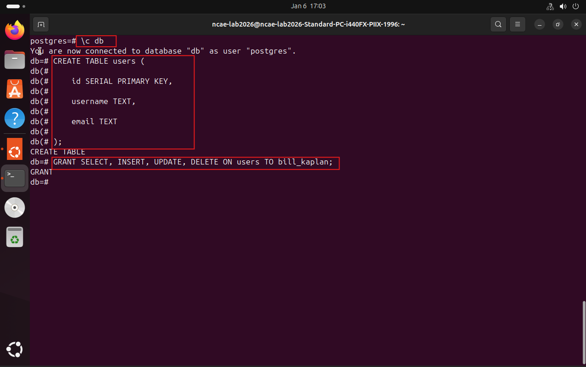
---

### 6. Validate Database Access

Exit PostgreSQL and log in as the scoring user:
```bash
psql -h 127.0.0.1 -U bill_kaplan -d db
```
Run test queries:
```bash
INSERT INTO users (username, email) VALUES ('testuser', 'test@example.com');  
SELECT * FROM users;
```

If these commands work, the database service is scoring-ready.
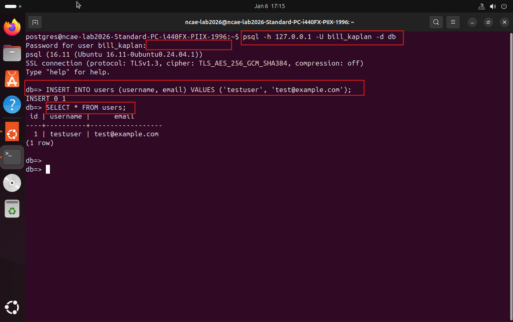

---

## PostgreSQL Network Access Configuration (REQUIRED)

By default, PostgreSQL only listens on `localhost`.
This prevents other machines on the network from connecting, even if routing and firewall rules are configured correctly.

In the NCAE environment, the PostgreSQL database must be reachable from the internal network
(172.18.0.0/16) by scoring services and internal hosts.

This configuration is internal-only.
No router port forward is required, and PostgreSQL should never be exposed to the WAN.

---

## Modify PostgreSQL Listening Address

```bash
sudo nano /etc/postgresql/*/main/postgresql.conf
```

Locate the following line:
```text
listen_addresses = 'localhost'
```
postGresConfListenAddress.png
Change it to:
```text
listen_addresses = '*'
```

This allows PostgreSQL to bind to all available interfaces, including the internal 172.18.x.x address.

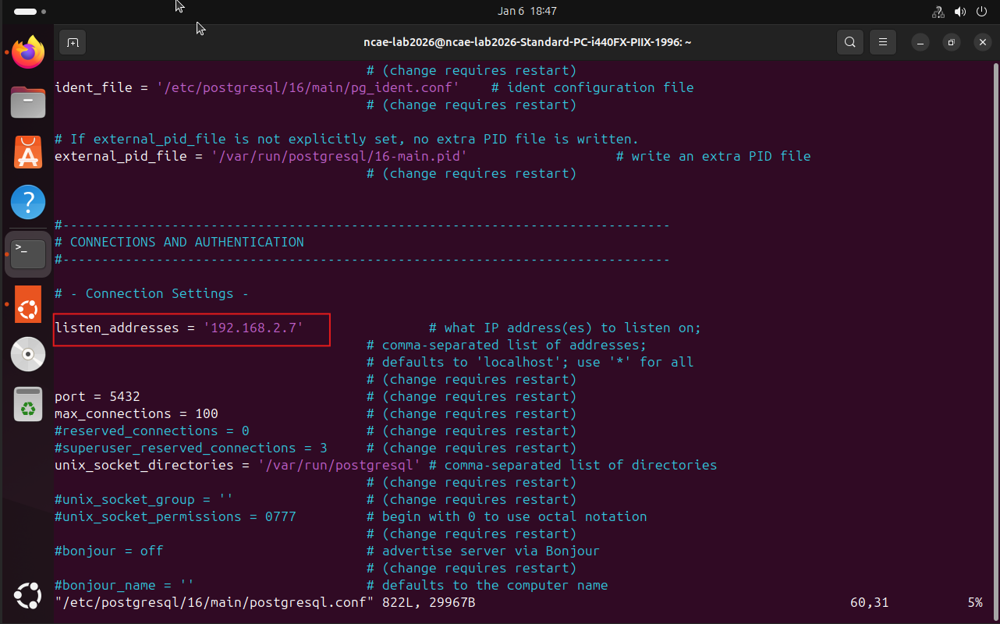

---

## Allow Incoming Connections from the Internal Network

```bash
sudo nano /etc/postgresql/*/main/pg_hba.conf
```
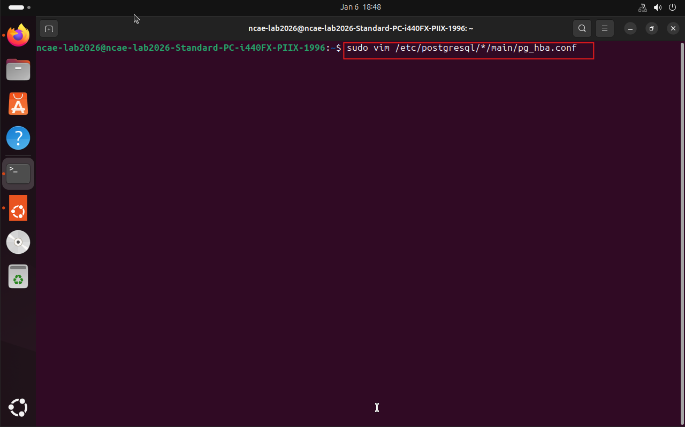

```text
Add the following rule near the bottom of the file:

host    db    bill_kaplan    172.18.0.0/16    scram-sha-256

This rule allows:
- TCP connections to database db
- From the internal NCAE network
- For user bill_kaplan
- Using secure password authentication
```
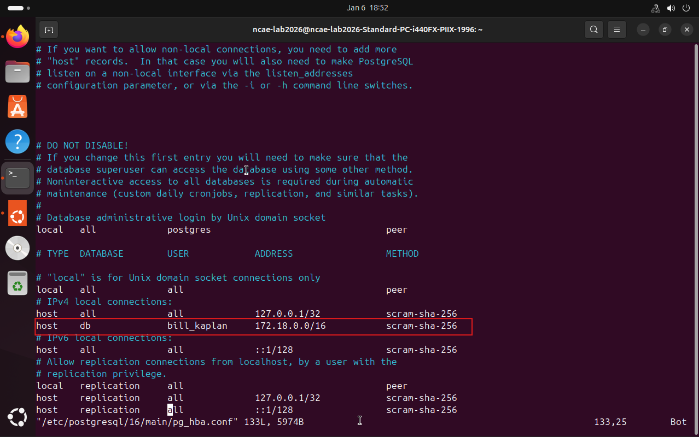


---


## PostgreSQL Port Forward (REQUIRED)

The PostgreSQL database server is hosted on the **internal network** and must be reachable
by scoring services.

### PostgreSQL Service Details
- Internal IP: `192.168.t.7`
- Protocol: TCP
- Port: `5432`

Because the database server lives on the internal LAN, traffic must be forwarded
through the MikroTik router.

---

### Create PostgreSQL DST-NAT Rule (WAN → LAN)

Navigate to:

Advanced → IP → Firewall → NAT → New

**General Tab**
- Chain: dstnat
- Protocol: tcp
- Dst. Port: 5432
- In. Interface: WAN

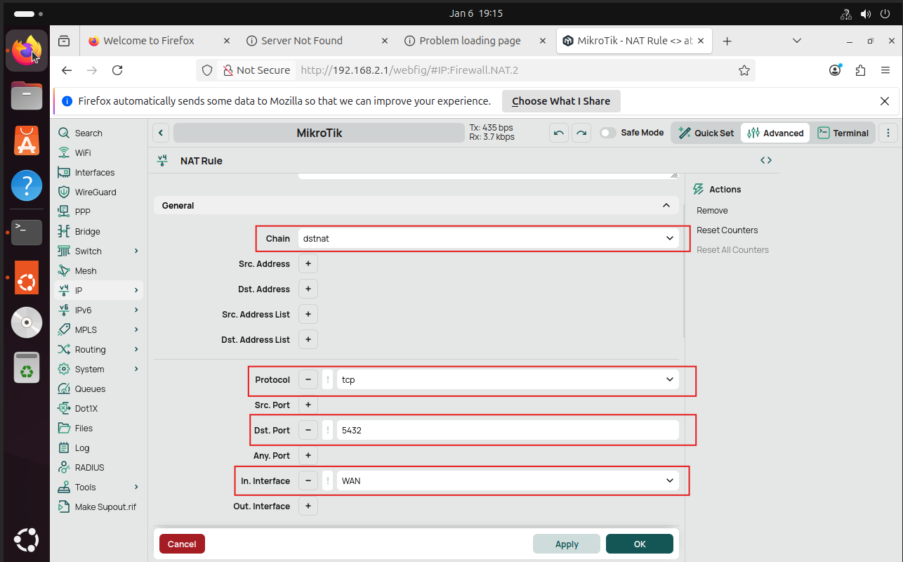

**Action Tab**
- Action: dst-nat
- To Addresses: 192.168.t.7
- To Ports: 5432

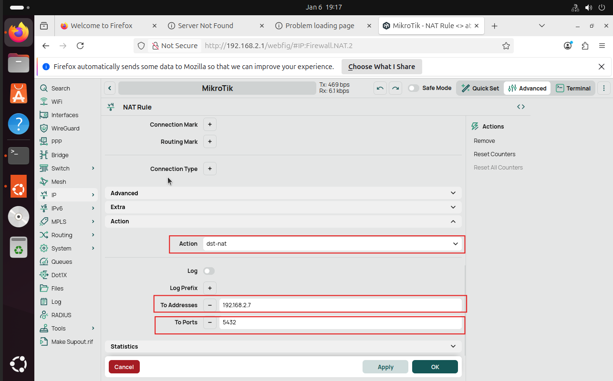

---

### Allow PostgreSQL Traffic Through Firewall

Add a firewall filter rule:

Advanced → IP → Firewall → Filter Rules → New

**General Tab**
- Chain: forward
- Protocol: tcp
- Dst. Port: 5432
- In. Interface: WAN
- Out. Interface: LAN

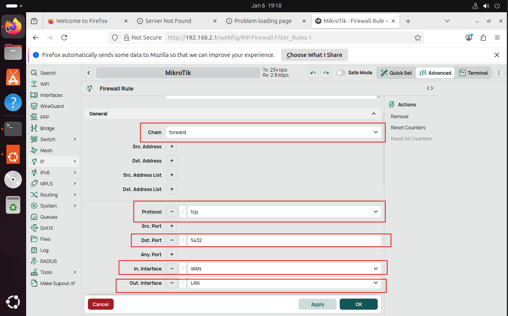

**Action Tab**
- Action: accept

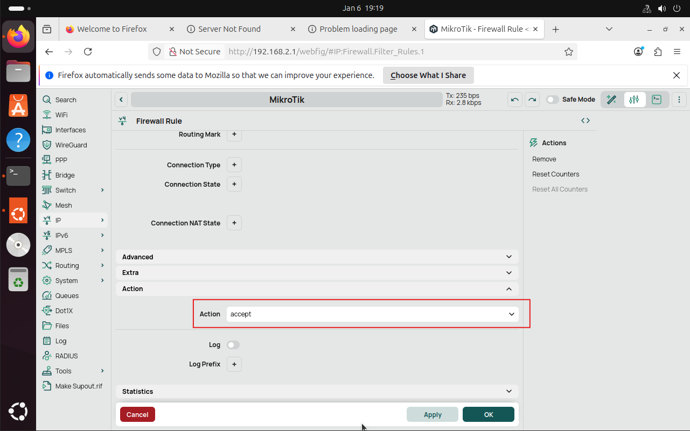
---


### Important Note on SMB Access

For SMB scoring, focus on:
- Samba service running
- Correct users and passwords
- Proper permissions on `/mnt/files`
- Host-based firewall allowing SMB traffic

Router port forwarding does **not** apply to this service.

---

## SMB / File Services (Shell Server)

Although earlier documentation may reference **FTP**, the competition uses **SMB (Samba)** for file services.

This server hosts shared files for staff and external associates and must remain available.

---

## SMB Scoring Requirements (IMPORTANT)

**Operating System**
- Ubuntu 24.04

**Shared Directory**
- /mnt/files

**Authentication**
- Linux users mapped to Samba users
- Shared password for all scoring users:
  cnyrocks

**Scoring Checks**
- SMB login
- File read access
- File write access

---

## SMB Install & Configuration (Ubuntu)

### 1. Install Samba
```bash
sudo apt update && sudo apt install samba samba-common -y
```
Enable and start the service:
```bash
sudo systemctl enable smbd --now
```

---

### 2. Create Shared Directory
```bash
sudo mkdir -p /mnt/files  
sudo chmod 2777 /mnt/files
```

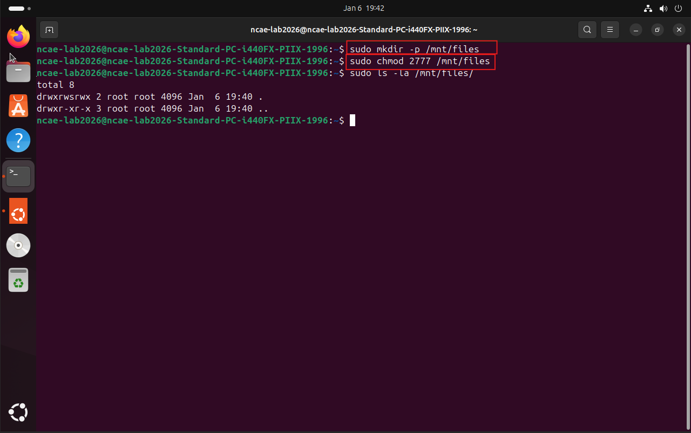

---

### 3. Create Linux Users

Create required Linux users (example):
```bash
sudo useradd benjamin_franklin  
sudo useradd alexander_hamilton
```

Repeat for all scoring users.

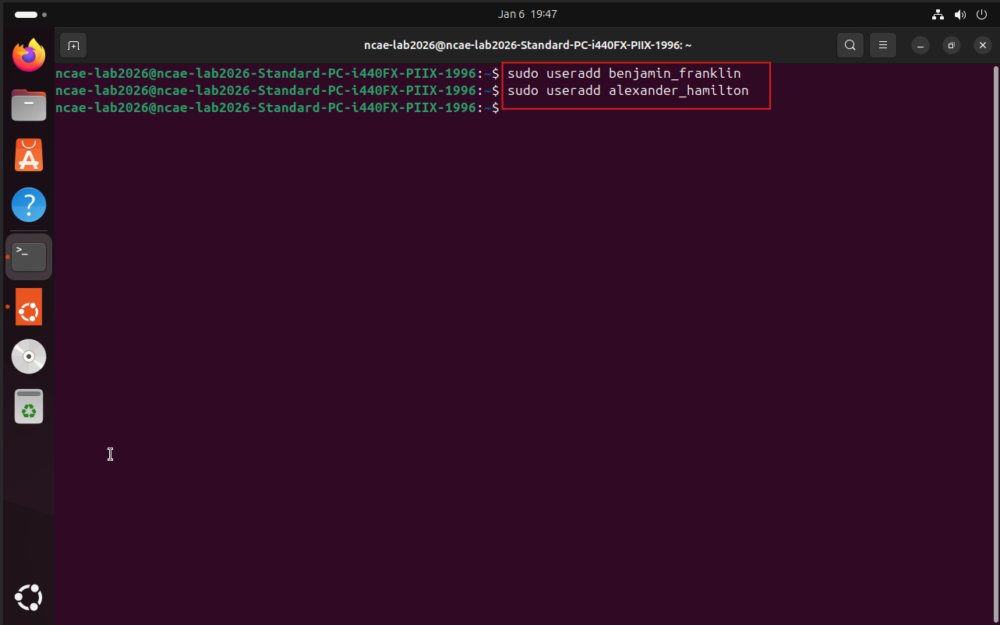

---

### 4. Create Samba Users

Add each user to Samba and set the password to `cnyrocks`:
```bash
sudo smbpasswd -a benjamin_franklin
```
Repeat for all scoring users.
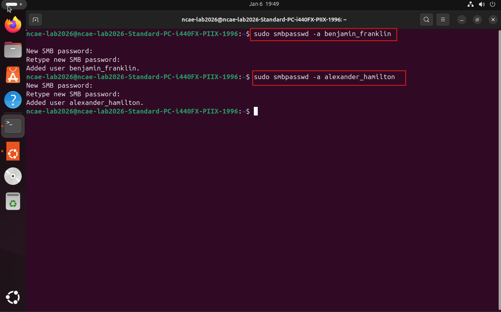
---

### 5. Configure Samba Share

Edit the Samba configuration file:
```bash
sudo nano /etc/samba/smb.conf
```
Add the following to the bottom of the file:
```text
[files]
    path = /mnt/files
    browseable = yes
    writable = yes
    guest ok = no
```
---

### 6. Restart Samba
```bash
sudo systemctl restart smbd
```

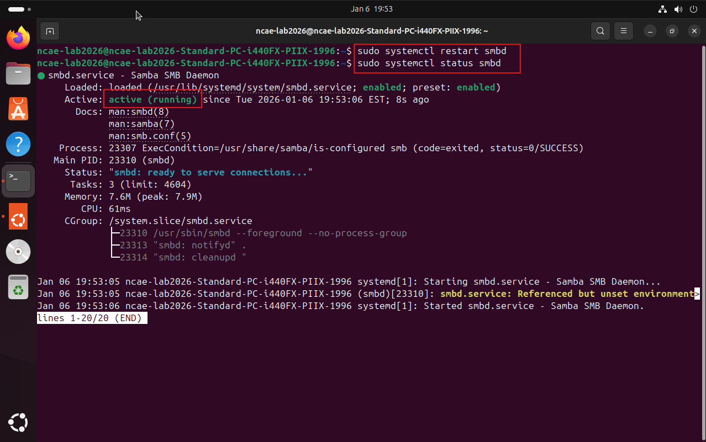

---

### 7. Populate Required Files

Create or copy any file into the directory:
```text
/mnt/files
```
```bash
echo "The SMB Server Works!" > /mnt/files/smbtest.txt
```

Ensure:
- Filenames match exactly
- Files are readable by SMB users

---

### 8. Validate SMB Access

From a client machine (external Kali VM):
- Log in using a scoring username
- Download an existing file
- Upload a new test file

```bash
smbclient //172.18.14.t/files -U benjamin_franklin
```
smblogin.png

If login, read, and write all succeed, the SMB service is scoring-ready.

---
