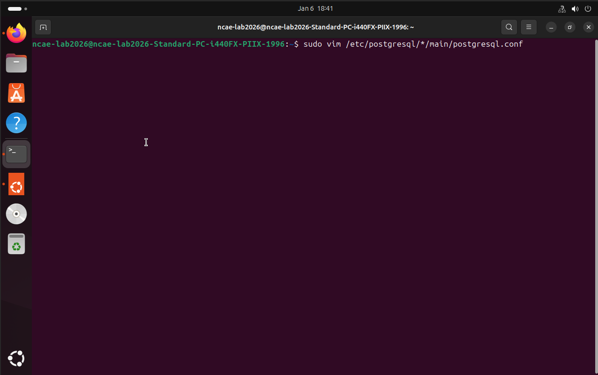

# Week 5 Summary – Database & File Services (PostgreSQL / SMB)

---

## Prerequisites

- Mikrotik Router ISO Installed in a VM  
- Ubuntu 24.04 Installed in a VM (**Database Server**)  
- Ubuntu 24.04 Installed in a VM (**Shell / File Server**)  

- Two Virtual Network Adapters (2 virtual networks total)
  - LAN
  - WAN

**Note:** Please review `Week2.md` if you are unsure how to configure the router or host networking.

`t = team number`

---

## PostgreSQL (Database Server)

This section focuses on configuring **PostgreSQL** to meet the **NCAE scoring requirements** for the database service.

The database server is used to:
- Store data for the web application
- Allow automated QA processes to read from the database
- Allow occasional write operations back into the database

PostgreSQL is **scored only from the internal team network** using the database server’s internal IP address.

---

## PostgreSQL Concepts (High Level)

You do **not** need deep database administration knowledge for the competition.  
The objective is to ensure PostgreSQL behaves exactly how scoring expects.

### What is SQL?

SQL (Structured Query Language) is used to:
- Create databases and tables
- Insert, read, update, and delete data
- Control access to stored data

### What Is a Database?

A database is a structured way to store information.

Think of it like:
- Excel = single spreadsheet
- PostgreSQL = multiple spreadsheets, users, permissions, and network access

---

### PostgreSQL Architecture (Simplified)

PostgreSQL is organized into the following components:

- **Database Cluster**
- **Databases**
- **Tables**
- **Rows (Records)**
- **Roles**

---

## PostgreSQL Scoring Requirements (IMPORTANT)

**Scoring User**
- Username: `bill_kaplan`
- Password: `b1ackjack!`

**Database**
- Name: `db`

**Table**
- Name: `users`

**Scoring Source**
- Internal network
- Database IP: `192.168.t.7`

---

## PostgreSQL Install & Configuration (Ubuntu)

### 1. Install PostgreSQL

```bash
sudo apt update && sudo apt install postgresql postgresql-contrib -y
```
---

### 2. Verify PostgreSQL Is Running

```bash
sudo systemctl start postgresql  
sudo systemctl status postgresql
```
PostgreSQL should be in an **active (running)** state.


---

### 3. Login and creating the Scoring Role

```bash
sudo -i -u postgres
```
```bash
psql
```
``bash
CREATE ROLE bill_kaplan WITH LOGIN PASSWORD 'b1ackjack!';
```


---

### 4. Create the Database

```bash
CREATE DATABASE db;
```
```bash
GRANT ALL PRIVILEGES ON DATABASE db TO bill_kaplan;
```


---

### 5. Create Required Table

```bash
\c db
```
```bash
CREATE TABLE users (
    id SERIAL PRIMARY KEY,
    username TEXT,
    email TEXT
);
```
```bash
GRANT USAGE, SELECT ON SEQUENCE users_id_seq TO bill_kaplan;
```


---

### 6. Validate Database Access

```bash
psql -h 127.0.0.1 -U bill_kaplan -d db
```
```bash
INSERT INTO users (username, email) VALUES ('testuser', 'test@example.com');
```
```bash
SELECT * FROM users;
```
If these commands work, the database service is scoring-ready.


---

## Modify PostgreSQL Listening Address

```bash
sudo nano /etc/postgresql/*/main/postgresql.conf
```
```text
listen_addresses = 'localhost'
```


```text
listen_addresses = '192.168.t.7'
```


---

## Allow Incoming Connections from the Internal Network

```bash
sudo nano /etc/postgresql/*/main/pg_hba.conf
```


```text
host    db    bill_kaplan    172.18.0.0/16    scram-sha-256
```


---

## PostgreSQL Port Forward (REQUIRED)


---

### Allow PostgreSQL Traffic Through Firewall


---

## SMB / File Services (Shell Server)

---

### Create Shared Directory

```bash
sudo mkdir -p /mnt/files  
sudo chmod 2777 /mnt/files


---

### Create Linux Users

```bash
sudo useradd benjamin_franklin  
sudo useradd alexander_hamilton


---

### Create Samba Users

```bash
sudo smbpasswd -a benjamin_franklin


---

### Restart Samba

```bash
sudo systemctl restart smbd


---

### Validate SMB Access

If login, read, and write all succeed, the SMB service is scoring-ready.

---